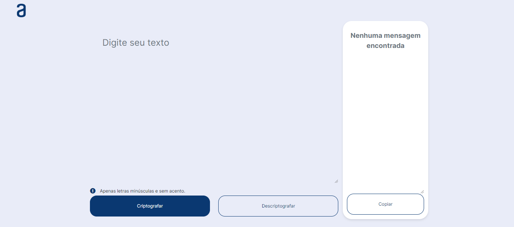

  

    <h2>Bem-vindo ao repositório do <strong>Challenge-Decodificador</strong>!</h2>
    
Este projeto faz parte do curso "Praticando Lógica de Programação: Challenge Decodificador de Texto", através da ONE em parceria com a Alura.

  

  

## Descrição

O **Challenge-Decodificador** é uma aplicação web que permite codificar e decodificar textos com base em um algoritmo específico. O objetivo do projeto é praticar e aprimorar suas habilidades de lógica de programação, utilizando tecnologias web modernas.

## Tecnologias Utilizadas

 

A imagem acima mostra a interface da aplicação, semelhante o design proposto no [Figma](https://www.figma.com/proto/f0TymOzlC7AsnKy0tmD69y/Alura-Challenge---Desafio-1---L%C3%B3gica-(Copy)?t=ExjlTNFps7OQLz6j-1).
